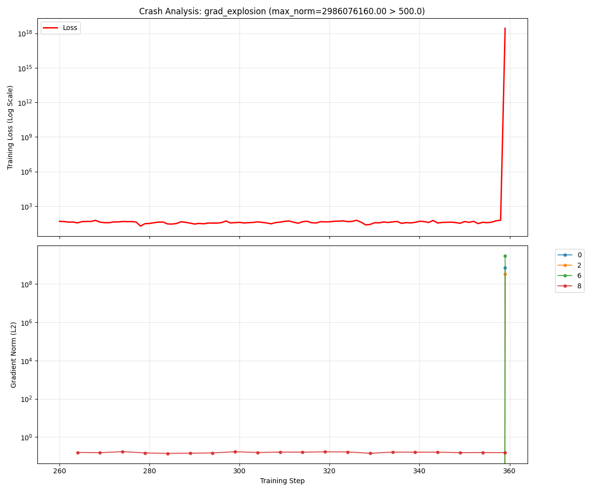

# Neural Observer 

**Failure-Aware Diagnostics for Deep Neural Models.**

`neural-observer` is a lightweight instrumentation library designed to diagnose training instabilities (Gradient Explosions, Loss Spikes, NaNs) in deep multi-modal models. 

Unlike standard loggers (W&B, TensorBoard) which only record *averages*, Neural Observer acts as a **Flight Recorder**: it maintains a high-frequency circular buffer of per-layer statistics in RAM and only dumps the history to disk when a crash is detected.


*Above: A capture of a Gradient Explosion on a standard ConvNet. Note how Layer 6 (Green) explodes exponentially at step 359, while Layer 8 (Red) remains stable. The system captured the exact moment of failure automatically.*

##  Key Features

* **Zero-Config Instrumentation:** Auto-attaches to `nn.Linear`, `nn.Conv2d`, `nn.LayerNorm`, and `nn.Embedding` via PyTorch hooks.
* **Low-Overhead Ring Buffer:** Stores the last `N` steps of training dynamics (gradients, activations) in CPU RAM. Zero VRAM penalty.
* **Smart Trigger Engine:** Automatically halts training and saves a crash report when:
    * Loss spikes > 3x the moving average.
    * Gradient norms exceed a safety threshold.
    * NaNs or Infs appear in the loss.
* **Crash Forensics:** Dumps a JSON report containing the exact sequence of layer stats leading up to the failure.

##  Installation

```bash
pip install -r requirements.txt